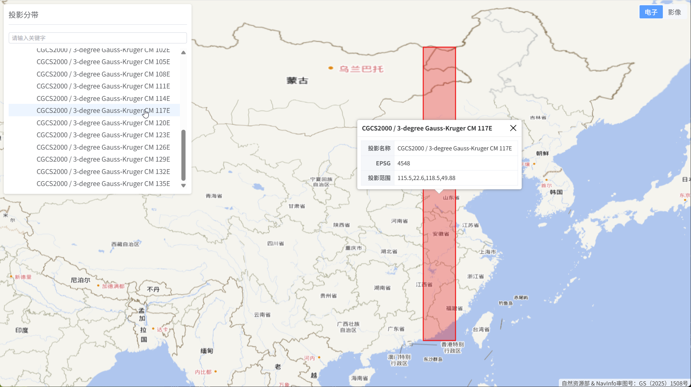

# Vue 3 + Vite

此模板将帮助您开始使用 Vite 开发 Vue 3 项目。该模板采用 Vue 3 `<script setup>` 单文件组件，请查阅 [script setup 文档](https://cn.vuejs.org/api/sfc-script-setup) 了解更多信息。

了解更多关于 Vue 的 IDE 支持，请查阅[Vue 文档扩展指南中的 IDE 支持章节](https://cn.vuejs.org/guide/scaling-up/tooling#ide-support)。

# 实现效果

访问地址：[https://gisnotes.github.io/cgcs2000-projection-zones/](https://gisnotes.github.io/cgcs2000-projection-zones/)

# 提交记录
1. [项目初始化](https://github.com/gisnotes/cgcs2000-projection-zones/commit/d098db67ce6c2b3d20cea4793b7fb42a683ca594)
2. [分度带的可视化 + 属性弹窗](https://github.com/gisnotes/cgcs2000-projection-zones/commit/d5659c6ce6f779a23bea6d023b6bc2a71c465292)
3. [增加窗口折叠功能](https://github.com/gisnotes/cgcs2000-projection-zones/commit/f7ed7a4272cbaecdaacf9293b3e66a0fe1bfc667)
4. [分度带分类可视化](https://github.com/gisnotes/cgcs2000-projection-zones/commit/059cf37bcd6be7494a30fa27b54394a8343c9943)